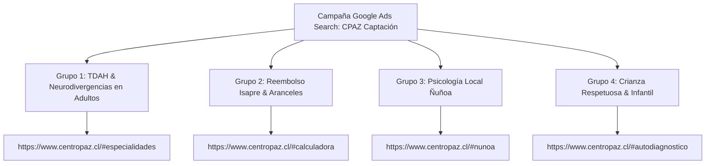

# 🎯 Playbook de Google Ads Search — Centro Paz (CPAZ)

Este documento contiene la arquitectura exacta, grupos de anuncios, palabras clave y lista de negativas para lanzar campañas de **Google Ads Search (Red de Búsqueda)** con el costo por adquisición (CPA) más bajo y la tasa de conversión más alta hacia WhatsApp (+56 9 6516 3893).

---

## ⚙️ 1. Configuración de Campaña en Google Ads

| Parámetro | Configuración Recomendada | Razón Técnica |
| :--- | :--- | :--- |
| **Tipo de Campaña** | Red de Búsqueda (Google Search Network) | Solo capta a usuarios que están buscando activamente un psicólogo en este momento. |
| **Redes** | Desactivar "Incluir partners de búsqueda de Google" y desactivar "Red de Display". | Evita gastar presupuesto en banners visuales de baja intención. |
| **Ubicación Geográfica** | **Nivel 1 (Prioridad Alta):** Región Metropolitana (Ñuñoa, Providencia, Las Condes, La Reina, Peñalolén, Santiago Centro).<br>**Nivel 2 (Online):** Chile Nacional. | Concentra la inversión en comunas de alta capacidad de copago y cercanía presencial a Ñuñoa. |
| **Idiomas** | Español | Evita tráfico extranjero. |
| **Estrategia de Puja** | **Fase 1 (Días 1 a 14):** *Maximizar Clics* con límite de CPC Máximo de **$450 a $650 CLP**.<br>**Fase 2 (Días 15+):** *Maximizar Conversiones* (evento de clic en botón WhatsApp). | Controla el costo por clic inicial y luego optimiza por pacientes reales que abren el chat. |
| **Presupuesto Diario Sugerido** | **$5.000 a $10.000 CLP / día** (~$150.000 a $300.000 CLP al mes). | Suficiente para generar entre 12 y 25 clics diarios de alta intención. |

---

## 👥 2. Los 4 Grupos de Anuncios de Alta Intención



---

### 📌 Grupo de Anuncios 1: TDAH & Neurodivergencias en Adultos

* **Página de Destino:** `https://www.centropaz.cl/?utm_source=google_ads&utm_campaign=search_tdah#especialidades`
* **Palabras Clave (Concordancia Exacta `[ ]` y de Frase `" "`):**
  ```text
  [psicologo tdah adultos]
  [psicologo tdah santiago]
  [psicologa especialista tdah adultos chile]
  [terapia tdah adultos chile]
  [evaluacion tdah adultos santiago]
  "psicologo neuroafirmativo santiago"
  "psicologa neurodivergencia adultos"
  "terapia tdah ñuñoa"
  "diagnostico tardio tdah adultos chile"
  ```
* **Títulos del Anuncio (Headlines - 30 caracteres máx):**
  - `Terapia TDAH en Adultos` (Fijar en Posición 1)
  - `Centro Paz · Psicología Clínica` (Fijar en Posición 2)
  - `Enfoque Neuroafirmativo`
  - `Atención Online y en Ñuñoa`
  - `Reembolso en Todas las Isapres`
  - `Valentina Castro Núñez · SIS`
  - `Parálisis Ejecutiva & Masking`
  - `Sin Juicios ni Etiquetas`
  - `Copago Real desde $12.000`
  - `Escríbenos por WhatsApp`
* **Descripciones del Anuncio (Descriptions - 90 caracteres máx):**
  1. `¿Cansancio crónico o dificultad para concentrarte? Terapia especializada en TDAH y TEA.`
  2. `Psicóloga clínica con enfoque neuroafirmativo. Boletas 100% reembolsables en tu Isapre.`
  3. `Sesiones online para todo Chile y presenciales en Ñuñoa. Agenda directo con Valentina.`
  4. `Comprende tu funcionamiento singular y aprende herramientas reales para tu día a día.`

---

### 📌 Grupo de Anuncios 2: Reembolso Isapre (Derribador de Objeción de Precio)

* **Página de Destino:** `https://www.centropaz.cl/?utm_source=google_ads&utm_campaign=search_isapre#calculadora`
* **Palabras Clave:**
  ```text
  [psicologo reembolso isapre]
  [psicologo colmena reembolso]
  [psicologo banmedica reembolso]
  [psicologo cruzblanca reembolso]
  [psicologo consalud reembolso]
  [psicologo vida tres reembolso]
  "psicologo con boleta para isapre"
  "cuanto cubre la isapre en psicologo"
  "psicologa reembolso seguro complementario"
  ```
* **Títulos del Anuncio:**
  - `Psicología con Reembolso Isapre` (Posición 1)
  - `Recupera del 50% al 80%` (Posición 2)
  - `Boletas Electrónicas SIS`
  - `Colmena, Banmédica y Más`
  - `Copago Real ~$15.000 CLP`
  - `Simula tu Reembolso en Vivo`
  - `Psicóloga Valentina Castro N.`
  - `Atención Online y Ñuñoa`
* **Descripciones:**
  1. `Emisión inmediata de boletas oficiales para reembolso en tu Isapre y Seguro Complementario.`
  2. `Atiéndete con psicóloga clínica titulada. Copago real estimado desde $9.000 a $18.000 CLP.`
  3. `Simula tu reembolso en nuestro sitio web y agenda directamente por WhatsApp.`

---

### 📌 Grupo de Anuncios 3: Psicología Clínica Local Ñuñoa / Santiago Oriente

* **Página de Destino:** `https://www.centropaz.cl/?utm_source=google_ads&utm_campaign=search_nunoa#nunoa`
* **Palabras Clave:**
  ```text
  [psicologo ñuñoa]
  [psicologa ñuñoa]
  [psicologo plaza ñuñoa]
  [psicologo metro chile españa]
  [terapia psicologica ñuñoa]
  "psicologo infantil ñuñoa"
  "consulta psicologica ñuñoa santiago"
  "psicologa clinica plaza egaña"
  ```
* **Títulos del Anuncio:**
  - `Psicóloga Clínica en Ñuñoa` (Posición 1)
  - `Sector Metro Chile España` (Posición 2)
  - `Centro Paz · Consulta Presencial`
  - `Adultos, TDAH e Infancia`
  - `Boletas Reembolsables Isapre`
  - `Sala Clínica Sensorial`
  - `Valentina Castro Núñez`
* **Descripciones:**
  1. `Consulta psicológica presencial en Ñuñoa a pasos de Metro Chile España y Plaza Ñuñoa.`
  2. `Espacio cálido y confidencial para adultos, adolescentes e infancia. Reembolso Isapres.`
  3. `Atención personalizada con la psicóloga Valentina Castro. Consulta disponibilidad hoy.`

---

### 📌 Grupo de Anuncios 4: Crianza Respetuosa & Terapia Infanto-Juvenil

* **Página de Destino:** `https://www.centropaz.cl/?utm_source=google_ads&utm_campaign=search_crianza#especialidades`
* **Palabras Clave:**
  ```text
  [psicologo infantil santiago]
  [psicologo infantil ñuñoa]
  [orientacion a padres crianza chile]
  [terapia infantil pataletas desbordes]
  "psicologa infantil santiago oriente"
  "apoyo crianza respetuosa santiago"
  "sospecha tea tdah niños terapia"
  ```
* **Títulos del Anuncio:**
  - `Terapia Infantil en Ñuñoa` (Posición 1)
  - `Orientación a Padres en Crianza` (Posición 2)
  - `Pautas sin Gritos ni Culpa`
  - `Desbordes Emocionales y TEA/TDAH`
  - `Espacio Lúdico en Ñuñoa`
  - `Sesiones Online para Padres`
  - `Reembolso en Isapres`
* **Descripciones:**
  1. `Acompañamos a tu hijo/a en sesión presencial y te entregamos pautas respetuosas de crianza.`
  2. `Manejo de frustración, rutinas y desbordes emocionales desde un enfoque humanista y lúdico.`
  3. `Boletas de honorarios para reembolso en Isapres y Seguros de Salud.`

---

## 🚫 3. Lista Maestra de Palabras Clave Negativas (Negative Keywords)

Para evitar que tu presupuesto se gaste en búsquedas que no generan pacientes particulares:

```text
# Gratuito / Fonasa directo
gratis
gratuito
gratuita
fonasa bono directo
bono fonasa nivel 1
cesfam
cosam
hospital publico

# Laboral / Empleo
empleo
trabajo
oferta laboral
vacantes
practica profesional
sueldo psicologo
arriendo consulta psicologo

# Académico / Descargas
pdf
libro
descargar libro
definicion
wikipedia
tesis
monografia
universidad
malla curricular
curso
diplomado
magister
test online gratis
cuestionario gratis
```

---

## 🔗 4. Extensiones de Anuncio (Assets) Indispensables

1. **Vínculos a Sitios (Sitelinks):**
   - *Simulador Reembolso Isapre* ➡️ `https://www.centropaz.cl/#calculadora`
   - *Biblioteca de 28 Artículos* ➡️ `https://www.centropaz.cl/#biblioteca`
   - *Consulta Presencial Ñuñoa* ➡️ `https://www.centropaz.cl/#nunoa`
   - *Orientador en 3 Pasos* ➡️ `https://www.centropaz.cl/#orientador`
2. **Textos Destacados (Callouts):**
   - *Boletas 100% Reembolsables en Isapres*
   - *Registro Superintendencia de Salud*
   - *Atención 100% Humana en WhatsApp*
   - *Modalidad Online y Presencial en Ñuñoa*
3. **Fragmentos Estructurados (Structured Snippets):**
   - Tipo de encabezado: *Servicios*
   - Valores: *Terapia Adultos, TDAH y TEA, Terapia Infantil en Ñuñoa, Orientación a Padres, Ansiedad y Estrés*.
